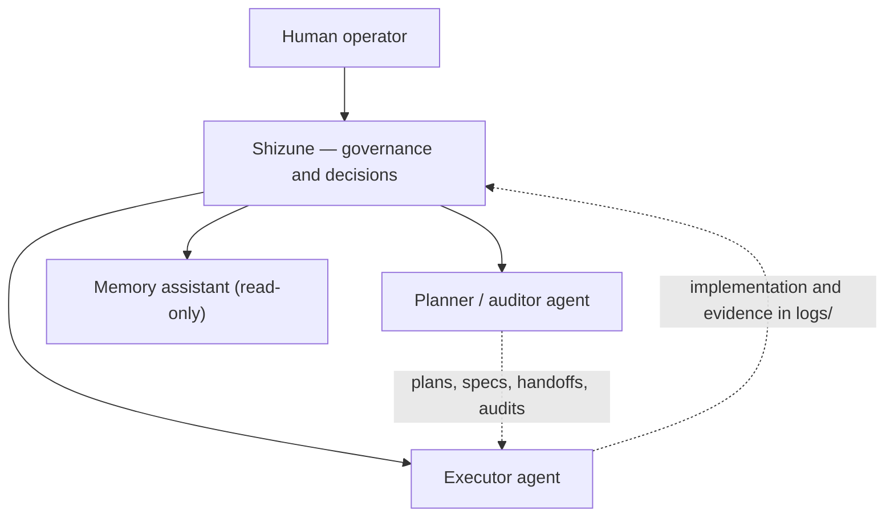

# AGENTS.md — Multi-agent contract of Shizune

This is the operating contract every AI agent reads before acting in a Shizune instance: roles, principles, tree rules, the skill pipeline, the risk matrix and the writing boundaries. In the public framework package this file **is** `AGENTS.md`; each instance may extend it with its own state, without weakening any rule stated here.

---

## 1. Roles and division of labour

| Role | Responsibility | Writes in Shizune? |
|---|---|---|
| **Planner / auditor** | Implementation plans, audits, writing decisions (ADRs) and handoffs, reviewing artifacts | Yes, per this contract |
| **Executor** | Implements handoffs block by block, runs local commands, produces evidence under `logs/` | Yes, records per this contract |
| **Memory assistant** | An assistant with its own persistent memory and human approval of every memory | **Never.** Read-only |

The **human operator is the final authority**: they approve stops, confirm or reject memories, and grant every [AUTHORIZATION] to write outside the Shizune root.

### Target topology: Orchestrator–Subagent

Mature instances may evolve towards the **orchestrator–subagent** pattern: an orchestrating agent decomposes goals, dispatches to specialised subagents (planning/audit, execution) and consolidates results — always under the risk matrix of section 7 and the stops of section 6. The transition is the operator's decision and requires reliability criteria met in supervised operation.

---

## 2. Operating principles

1. **Diagnosis before execution**: no modification without first establishing the real state of files, branches and variables on disk.
2. **Short, incremental steps**: small changes, with explicit and justified diffs.
3. **Mandatory human approval** for sensitive actions: architectural changes, financial interventions, data deletion and any externally visible effect.
4. **Scope isolation per project**: each task operates inside the declared project (canonical slug); no side effects on other projects.
5. **Secure by default**: never read, display, commit or persist `.env` files, credentials or secrets in logs and documents.
6. **Epistemic humility**: agents do not fake certainty and do not invent data; gaps and limitations are always stated. Unmeasured marketing or sales numbers are hypotheses to validate, never facts.

---

## 3. Information reliability — the five pillars

Information earns trust when it: (1) comes from a **qualified source** (primary/official); (2) has **independent corroboration**; (3) holds **semantic consistency** across sources; (4) states **context, date and limitations**; (5) is **separable from opinion** or marketing.

When sources disagree: arbitrating by assumption is forbidden; stating the disagreement, naming the evidence level on each side and recommending practical validation is mandatory.

---

## 4. Tree rules

- **Mandatory frontmatter**: every new `.md` is born with the v2 YAML block of six fields, in this order: `id`, `tipo`, `projeto`, `status`, `data`, `autor`. Exception: `SKILL.md` opens with `name` and `description` (Anthropic Agent Skills spec) followed by the six fields in the same block.
- **Canonical slugs**: single source in `governance/registro-projetos.yaml`. Never invent a slug.
- **Links are always relative** — absolute machine paths break in any other instance.
- **Dated records are immutable**: status files, reports and evidence live under `logs/<year>/<slug>/` and are never edited after creation — a correction is born as a new record.
- **Nothing is deleted**: superseded documents move to `archive/` with a supersession banner.
- **Decisions become ADRs**: Nygard format (Context/Decision/Consequences) under `governance/adr/`, always-increasing numbering, supersession by status mark — never by editing.
- **Decisions the build enforces**: the ADR is the prose; `governance/registro-decisoes.md` is the thin layer a commit can cite as `Decision: DEC-001` in its trailer. A commit citing a decision that does not exist, or one with no signer, or one whose SHA does not resolve, **fails the build**. A decision may be born as a draft (`rascunho, assinatura pendente`): it warns while nobody has signed it, and any commit that cites it fails. You draft; the human signs; the SHA activates. An agent never marks a decision signed on the operator's behalf — putting a name on a row is the one act that is theirs.
- **Requiring key signatures is the operator's call, and it is off by default**: declaring an authorship frontier and a trust list — both inside the repository, never on one machine — makes every commit after the frontier require a good signature from a listed key. Absent them, nothing fails and the validator says the layer is off. Until it is on, no document may describe the record as cryptographically verified; the quickstart has the setup.
- **Validation**: `bun scripts/doctor.mjs` runs everything in one command — `validate-structure.mjs` (frontmatter, slugs and absence of secrets), `validate-links.mjs` (relative links), `validate-prose-refs.mjs` (references in prose), `validate-state.mjs` (governance state), `validate-decisions.mjs` (the decision record), the export in dry-run, and the negative tests that prove the decision validator and the index generator still fail when they should. Each remains available on its own; two steps report `n/a` outside the instance a package was exported from.
- **Search before sweeping**: to answer a question about the repository state, read the smallest set of files that answers it — the generated index (`bun scripts/build-index.mjs` writes it; it does not exist until you run it), the date in the filename prefix under `logs/<year>/<slug>/`, and the "state of variables" section of the project file. A broad sweep is a last resort and must be announced before it starts.

---

## 5. Skill pipeline

The backbone of the workflow. Canonical source and index: [skills/README.md](skills/README.md), under `skills/{core-pipeline, meta, ops}/`. Artifact templates in `templates/`.

| Skill | Artifact produced |
|---|---|
| `grill-with-docs` | Interrogated requirements — questions resolved before modelling |
| `domain-modeling` | Domain model: entities, invariants, vocabulary |
| `to-spec` | Executable specification, ready for implementation |
| `implement` | Implementation with evidence (tests, diffs) |
| `handoff` | A `.md` + `.json` handoff pair with blocks and stops for the executor |
| `writing-for-agents` | Meta-skill: rules for agent-readable writing, applied to every artifact |

Pipeline order: `grill-with-docs → domain-modeling → to-spec → implement → handoff`.

---

## 6. Rounds and PARADAs (human gates)

Work is organised into **Rounds**; within each one, named **PARADAs** are human approval gates:

1. On reaching a PARADA, the agent **stops execution** and presents the state plus evidence.
2. It proceeds only with explicit operator authorisation. Silence is not clearance; never assume the gate has passed.
3. Every round closes with the `.md` + `.json` handoff pair (same `handoff_id`) and an immutable record under `logs/`.

---

## 7. Risk level matrix

Every agent action is classified **before** it runs:

| Level | Class | Examples | Condition to execute |
|---|---|---|---|
| **T1** | Read-only | reading files, `git log`/`git diff`, searches, validators | Free |
| **T2** | Safe mutation | creating new documents in the authorised scope, editing an artifact of the current round, local commit | Allowed, with a record (conventional commit and/or an entry under `logs/`) |
| **T3** | Sensitive mutation | editing outside the declared scope, writing outside the Shizune root, changing tool configuration | Explicit, prior, case-by-case **[AUTHORIZATION]** from the operator |
| **T4** | Destructive / production | irreversible deletion or overwrite, any touch on production, financial or client data | **Human-in-the-loop mandatory**: a formal human stop with evidence — never blanket authorisation |

When torn between two levels, assume the higher one. [templates/handoff.json](templates/handoff.json) uses this vocabulary in its `risk_tier` fields.

---

## 8. Writing boundaries

1. **Writing outside the Shizune root** requires explicit operator authorisation, marked **[AUTHORIZATION]** — including project repositories, user directories and global tool configuration.
2. **Memory assistants never write in Shizune** — a permanent prohibition; approving memories is exclusively human.
3. Inside Shizune, respect the immutability of `logs/` and the `archive/` destination (section 4).
