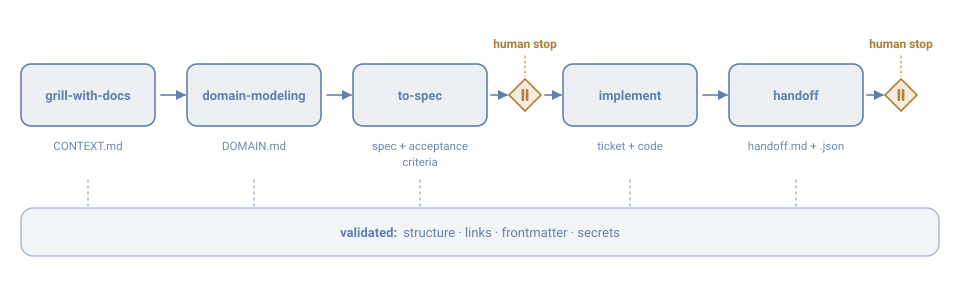

<div align="center">

# Brain Framework

**A governance operating system for AI agents.**

Give a coding agent trustworthy context, a named skill pipeline and verifiable writing rules — before it touches any code.

[](LICENSE)
[](https://github.com/CaduAzeredo/brain-framework/actions/workflows/ci.yml)
[](https://github.com/CaduAzeredo/brain-framework/releases/latest)
[](#quickstart)
[](https://www.caduazeredo.com/)



**[caduazeredo.com](https://www.caduazeredo.com/)** · [Quickstart](QUICKSTART.md) · [Discussions](https://github.com/CaduAzeredo/brain-framework/discussions)

</div>

## Quickstart

```bash
git clone https://github.com/CaduAzeredo/brain-framework.git
cd brain-framework

bun scripts/doctor.mjs                 # or: node scripts/doctor.mjs — runs every check
bun scripts/new-project.mjs my-project # scaffold a project
```

Then fill in `projects/my-project/CONTEXT.md`, starting from the `grill-with-docs` skill, and follow the pipeline through to `handoff`. Full walkthrough in [QUICKSTART.md](QUICKSTART.md).

**No `bun install`, no `npm install`.** The framework has **zero dependencies**: the scripts use only builtins and there is no `package.json`. That is deliberate — it runs on any machine with a JS runtime, with no install step. You need **Bun** (recommended) or **Node.js 20+**, and **git**.

> **Language, v0.2.** The public surface — this README, the quickstart, the agent contract, the contributing guide and the worked example — is written in English. `skills/` and `templates/` are still in Brazilian Portuguese in this release, and so are the frontmatter field names (`tipo`, `projeto`, `data`, `autor`). Translating them is the headline item of the next release — see the [translation issue](https://github.com/CaduAzeredo/brain-framework/issues/new?template=translation.yml). Folder and file names are mostly English; a few structural names are still Portuguese (`templates/projeto/`, and the frontmatter fields above), and they are part of the same translation pass. The framework works in either language, and we would rather ship the machinery than hold it back for a translation pass.

## Why it exists

AI agents degrade without structure. With no explicit contract, every session reinvents the context, contradicts earlier decisions, scatters unpatterned documents and blends hypothesis with fact. The Brain Framework attacks that with four mechanisms:

- **Canonical per-project context** — one `CONTEXT.md` per project is the single source of truth; the agent reads it before acting instead of inferring.
- **Recorded decisions (ADRs)** — what was decided, why, and what it superseded. Nothing is deleted: superseded documents move to `archive/`.
- **A skill pipeline** — the path from idea to delivered code is a named sequence of skills, not improvisation.
- **Automated validation** — scripts check structure, frontmatter, links and secret leakage; governance is checkable, not aspirational.

## Who it is for

- **Developers inheriting codebases** who need to know, in days rather than months, what works, what is unsafe and what is missing before launch.
- **Teams that want living documentation** — not "docs-as-code" but *docs-with-AI*: the document is the output of the pipeline and is validated like code.
- **Consultants selling technical audit plus governance** who need a standardised, auditable deliverable that replicates across clients.
- **Software producers** who want to validate quality, security and readiness **before** launch.

## What sets it apart

**Adversarial verification.** No finding enters the backlog because it looks plausible. Every candidate defect is re-verified by reading the real code, with a `file:line` reference, and receives an explicit verdict: **Confirmed**, **Partial** or **Refuted**. Hypotheses that fail to reconfirm are downgraded *in writing* — reporting what is **not** a problem counts as much as reporting what is.

**Real governance, not aspirational.** ADRs numbered and never renumbered; dated records that are immutable (a correction is born as a new record, never as an edit); formal quarantine for client data; and a validator that fails invalid structure.

**Instance / framework separation.** The framework (skills, templates, scripts, guides) is generic and exportable under Apache 2.0. The instance (real contexts, handoffs, logs, metrics) is private and **never** enters the export. Secrets enter nowhere at all.

**Fact vs. hypothesis.** Every unmeasured number is born marked `[HYPOTHESIS]`. Agents do not fake certainty: gaps and scope limits are stated in the report itself.

**A replicable pipeline.** The same process applied to projects in different domains produces the same deliverable format.

## What is included

| Component | What it is |
| --- | --- |
| `skills/` | The development pipeline: `grill-with-docs` → `domain-modeling` → `to-spec` → `implement` → `handoff`, plus the `writing-for-agents` meta-skill and the operations skills in `ops/`. |
| `templates/` | Artifact templates: ADR, spec, ticket, status, handoff (`.md` + `.json`), and `projeto/` with CONTEXT and DOMAIN. |
| `projects/` | *(created by the scaffolder, not shipped)* One folder per project, each with `CONTEXT.md`, `DOMAIN.md`, `specs/`, `tickets/` and `handoffs/`. |
| `governance/` | Generated index, project registry and the decisions of your instance. |
| `scripts/` | `doctor.mjs` (runs every check in one command), `new-project.mjs` (scaffolding), `validate-structure.mjs`, `validate-links.mjs`, `build-index.mjs` and `export-public.mjs`. |
| `examples/` | A complete synthetic project example (`course-platform-demo/` — context, domain, spec, tickets and a handoff pair). |
| `AGENTS.md` | The operating contract every agent reads first. |

## Basic use — technical audit of a project

1. **Authorise.** Write an ADR authorising the dossier and delimiting what stays quarantined. Use the `brain-adr` skill and the [templates/adr.md](templates/adr.md) template.
2. **Audit.** Run the audit workstreams over the codebase, **read-only**, with explicit and case-by-case authorisation for any command that writes outside the Brain.
3. **Record.** Produce the **immutable** report under `logs/<year>/<slug>/` — with methodology, scope, limits and the consolidated findings table (code, severity, verdict, backlog item).
4. **Dossier.** Generate `projects/<slug>/` through the pipeline: `CONTEXT.md` → `DOMAIN.md` → `specs/` → `tickets/` → `handoffs/`.
5. **Validate.** Run the validations before any commit.
6. **Commit.** Conventional Commits.

```bash
bun scripts/new-project.mjs my-project

bun scripts/doctor.mjs                    # runs every check; never writes

bun scripts/build-index.mjs
```

<!-- ref-ausente-ok: redaction-patterns.json — by design: the export never publishes the patterns file, because a list of what you are hiding is itself a disclosure. This paragraph is the instruction for creating your own. -->

> **On the export check.** `doctor` includes the public export in dry-run, but that step reports `n/a` until you configure it: the redaction patterns live in a file the export never publishes, so the framework cannot ship yours. Copy `scripts/redaction-patterns.example.json` to `governance/seguranca/redaction-patterns.json` and fill it with your own values — your email, your machine name, your client slugs. Until you do, no redaction pattern is evaluated, and nothing is protecting you from leaking a quarantined term.

> **Human stops.** No write outside the Brain, no push to a client repository and no externally visible action happens without explicit, case-by-case authorisation from the operator. Handoffs mark those stops as blocking.

## Non-negotiable rules

1. **Secrets never enter** — not in a log, not in a document, not in a commit. The validator fails fatally.
2. **Dated records are immutable** — a correction is born as a new record under `logs/`, never as an edit.
3. **Nothing is deleted** — superseded documents move to `archive/` with a supersession banner.
4. **Client quarantine** — projects marked blocked in the project registry never appear in public content, examples, demos or the export.
5. **Frontmatter is mandatory** — every new `.md` is born with `id`, `tipo`, `projeto`, `status`, `data`, `autor`.

## What the method delivers

| Deliverable | Contents |
| --- | --- |
| **Complete technical audit** | Immutable report with methodology, scope, limits and findings carrying `file:line` and a verdict |
| **Prioritised backlog** | Specs (behaviour contract plus acceptance criteria) and tickets (execution diary) |
| **Governed dossier** | CONTEXT, DOMAIN, ADRs, handoffs with human stops for the next executor |
| **Exportable case** | Synthetic version of the journey, in the format of the included example |
| **Replicable process** | Same pipeline, same deliverable format, across projects and domains |

## Evidence

This project holds itself to the rule it asks of you: **a number that was not measured is not published.**

The framework has been used on real client work under NDA. Those engagements are not described here — not the client, not the stack, not the aggregate findings. A client signature is identifiable even when "sanitised", and publishing audit metrics from private engagements would break the quarantine rule this framework exists to enforce.

What is public instead is the complete worked example in [examples/course-platform-demo/](examples/course-platform-demo/): a fictional product taken through the whole journey, from audit to governed dossier — context, domain, a spec with acceptance criteria, two tickets (one of them **deliberately blocked**, because an example that only shows finished work teaches the wrong lesson) and a handoff pair in `.md` and `.json`.

Public evidence on a real open source codebase is planned and has not been produced yet. When it exists, it will be linked here.

## Skill format

Skills follow the **Agent Skills** format: each skill is a folder containing a `SKILL.md` whose frontmatter opens with `name` and `description` — that is what lets an agent discover and load the skill on demand. In the Brain, the same frontmatter block also carries the framework governance fields, so skills are governed documents like any other.

## Using this commercially

The framework is free under Apache 2.0 and stays that way. Fork it, run it inside a company, build a product on it — the licence already grants that, and nothing here is gated.

If you want the method applied rather than adopted — a technical audit, a governed dossier, or help standing the pipeline up on your codebase — that is a conversation, not a checkout page. Start at **[caduazeredo.com](https://www.caduazeredo.com/)**, where each engagement is written out with its scope, or open a [discussion](https://github.com/CaduAzeredo/brain-framework/discussions). The author's contact is also in [NOTICE](NOTICE). There is no published price list: pricing that nobody has validated is a hypothesis, and this project does not publish hypotheses as facts.

## Trademark and naming

The composite **Brain Framework — by Cadu Azeredo** identifies this project and its origin. "Brain" on its own is a common word in this space and is claimed by no one here.

Apache License 2.0 grants patent and copyright rights; **section 6 explicitly grants no trademark rights.** The licence covers the code, not the name. Concretely:

- The name and visual identity are **not** licensed with the code.
- A fork is free under the licence, but must not present itself under the composite name or imply endorsement.
- Describing your work as *"built with the Brain Framework"* is welcome and needs no permission.
- No affiliation or endorsement is implied by use.

**Not affiliated with** other projects that use "brain" in their name. "Brain" is a common word in the AI-agent space; this project is the one at `CaduAzeredo/brain-framework`.

## License

Apache License 2.0 — Brain Framework © 2026 Cadu Azeredo. See [LICENSE](LICENSE) and [NOTICE](NOTICE).
