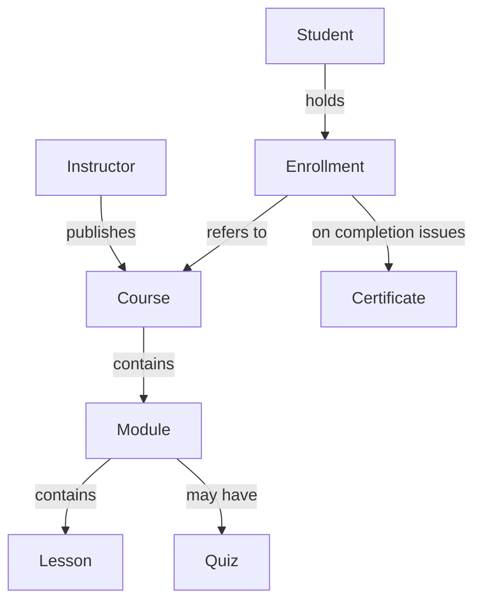

> **This is an example only — adapt it to your own project.** Domain of the fictional "Lumina" product, companion to [CONTEXT.md](CONTEXT.md), in the format of `templates/projeto/DOMAIN.md`.

# Lumina — Domain

Domain model of the fictional course platform: entities, relations, invariants and states. Produced by the `domain-modeling` skill from the context.

## Entities

| Entity | Definition |
| --- | --- |
| **Course** | A publishable unit created by an Instructor: title, description and ordered modules. |
| **Module** | An ordered grouping of Lessons within a Course; may carry one Quiz. |
| **Lesson** | A video with a title and a duration; belongs to exactly one Module. |
| **Quiz** | A set of questions belonging to a Module; produces one score per attempt. |
| **Instructor** | Author of Courses; sees completion metrics on the dashboard. |
| **Student** | An enrolled user; progresses through Lessons and Quizzes. |
| **Enrollment** | The Student↔Course link carrying progress; unique per pair. |
| **Certificate** | An immutable document issued when an Enrollment reaches completion. |

## Relations

## Invariants

1. An Enrollment is unique per (Student, Course) pair.
2. A Certificate is issued only when 100% of Lessons have been watched **and** every Quiz holds a passing score.
3. A Certificate is immutable after issuance — a correction produces a new certificate referencing the previous one, never an edit.
4. A Course is publishable only with at least one Module and one Lesson.

## States and transitions

- **Course**: draft → published → archived (archiving never affects certificates already issued).
- **Enrollment**: active → completed (the trigger for Certificate issuance) | cancelled.

## Outside the domain

Payments, marketplace, community and user-to-user messaging — deliberately outside this demo.
