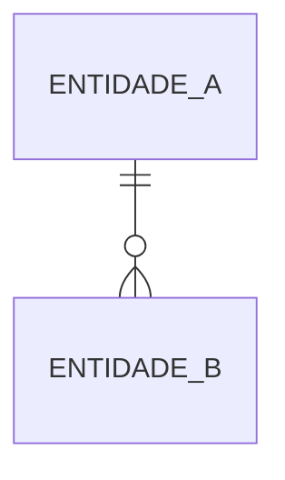

# Template — DOMAIN.md (mapa de domínio)

Mapa do domínio de um projeto: entidades, relações, invariantes e ciclos de vida — a fonte de verdade conceitual que specs e tickets referenciam. Copie o corpo abaixo para `projects/<slug>/DOMAIN.md`, preencha os `<placeholders>` e apague os comentários.
Toda invariante deve ser verificável: se não dá para testar ou inspecionar, é aspiração, não invariante.

````markdown
---
id: mapa-dominio-<slug-do-projeto>
tipo: mapa
projeto: <slug-do-projeto>
status: vigente
data: <aaaa-mm-dd>
autor: <autor>
---

# Domínio — <Nome do Projeto>

<!-- 1-2 frases: qual fatia do mundo este domínio modela. -->

## Entidades

<!-- Uma linha por entidade. Definição em uma frase, no vocabulário do domínio (não da implementação). -->

| Entidade | Definição |
| --- | --- |
| <Entidade> | <o que é, em uma frase> |

## Relações

<!-- Diagrama Mermaid (erDiagram ou graph). Toda entidade citada aqui deve existir na tabela acima. -->



## Invariantes

<!-- Numeradas e verificáveis. Regras que NUNCA podem ser violadas em nenhum estado válido do sistema. Specs e tickets citam "invariante I2". -->

1. **I1 —** <regra que nunca pode ser violada>
2. **I2 —** <regra>

## Estados e transições

<!-- Para cada entidade com ciclo de vida: estados possíveis e o evento que causa cada transição. Um stateDiagram Mermaid é bem-vindo quando o ciclo tem mais de 3 estados. -->

### <Entidade>

| De | Evento | Para |
| --- | --- | --- |
| <estado> | <evento ou ação> | <estado> |

## Fora do domínio

<!-- O que este projeto deliberadamente NÃO modela. Evita scope creep e specs órfãs. -->

- <conceito fora do domínio> — <onde vive, se em algum lugar>
````
